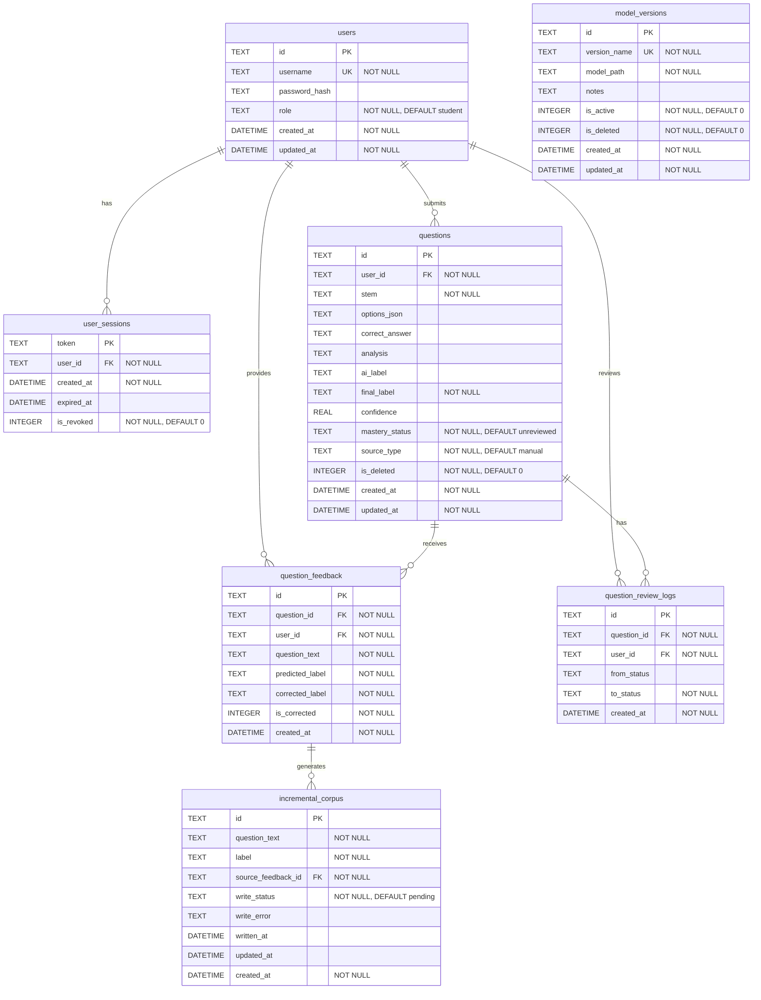

# TextCNN 数据库关系图 (ER Diagram)

## 总览

- 数据库: SQLite (`data/app.db`)
- 表数: 7
- 外键关系: 7
- 索引: 15

---

## ER 图 (Mermaid)



---

## 表关系说明

| 关系 | 说明 |
|---|---|
| `users` → `user_sessions` | 一个用户可有多个登录会话 |
| `users` → `questions` | 一个用户可提交多道题目 |
| `users` → `question_feedback` | 一个用户可提交多条反馈 |
| `users` → `question_review_logs` | 一个用户可有多条审阅记录 |
| `questions` → `question_feedback` | 一道题目可收到多条反馈 |
| `questions` → `question_review_logs` | 一道题目可有多条审阅记录 |
| `question_feedback` → `incremental_corpus` | 一条反馈可生成一条增量语料 |

---

## 核心数据流

```
用户提交题目 ──► questions
                    │
                    ▼ (模型分类)
              ai_label / final_label
                    │
                    ▼ (用户反馈纠错)
            question_feedback (is_corrected=1)
                    │
                    ▼ (管理员 flush)
           incremental_corpus (write_status=pending → written)
                    │
                    ▼ (写入文件)
              data/train.txt ──► vocab_built.py ──► train.py
                                                  │
                                                  ▼
                                          model_versions (注册新版本)
```

---

## 索引清单

| 表 | 索引名 | 列 | 用途 |
|---|---|---|---|
| users | `idx_users_role` | `(role)` | 按角色查询 |
| questions | `idx_questions_user_created` | `(user_id, created_at DESC)` | 用户题目列表 |
| questions | `idx_questions_final_label` | `(final_label)` | 按标签筛选 |
| questions | `idx_questions_mastery_status` | `(mastery_status)` | 按掌握状态筛选 |
| questions | `idx_questions_deleted` | `(is_deleted)` | 软删除过滤 |
| question_feedback | `idx_feedback_question` | `(question_id)` | 关联查询反馈 |
| question_feedback | `idx_feedback_created` | `(created_at DESC)` | 按时间排序 |
| question_feedback | `idx_feedback_corrected` | `(is_corrected)` | 筛选纠错反馈 |
| incremental_corpus | `idx_corpus_status` | `(write_status)` | 按写入状态筛选 |
| incremental_corpus | `idx_corpus_created` | `(created_at DESC)` | 按时间排序 |
| model_versions | `idx_model_versions_active` | `(is_active)` | 查询活跃版本 |
| user_sessions | `idx_sessions_user` | `(user_id, created_at DESC)` | 用户会话列表 |
| user_sessions | `idx_sessions_revoked` | `(is_revoked)` | 过滤已吊销会话 |
| question_review_logs | `idx_review_question` | `(question_id)` | 关联查询审阅日志 |
| question_review_logs | `idx_review_user_created` | `(user_id, created_at DESC)` | 用户审阅历史 |
