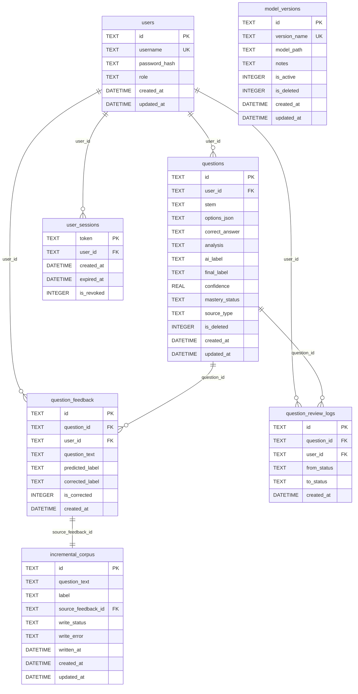

# E-R 图 —— Mermaid 代码
# 将以下代码粘贴到支持 Mermaid 的编辑器中即可渲染
# (如 Typora, VS Code + Mermaid 插件, mermaid.live 等)

```mermaid
erDiagram
    users ||--o{ questions : "user_id"
    users ||--o{ question_feedback : "user_id"
    users ||--o{ user_sessions : "user_id"
    users ||--o{ question_review_logs : "user_id"
    questions ||--o{ question_feedback : "question_id"
    questions ||--o{ question_review_logs : "question_id"
    question_feedback ||--|| incremental_corpus : "source_feedback_id"

    users {
        TEXT id PK
        TEXT username UK
        TEXT password_hash
        TEXT role
        DATETIME created_at
        DATETIME updated_at
    }

    questions {
        TEXT id PK
        TEXT user_id FK
        TEXT stem
        TEXT options_json
        TEXT correct_answer
        TEXT analysis
        TEXT ai_label
        TEXT final_label
        REAL confidence
        TEXT mastery_status
        TEXT source_type
        INTEGER is_deleted
        DATETIME created_at
        DATETIME updated_at
    }

    question_feedback {
        TEXT id PK
        TEXT question_id FK
        TEXT user_id FK
        TEXT question_text
        TEXT predicted_label
        TEXT corrected_label
        INTEGER is_corrected
        DATETIME created_at
    }

    incremental_corpus {
        TEXT id PK
        TEXT question_text
        TEXT label
        TEXT source_feedback_id FK
        TEXT write_status
        TEXT write_error
        DATETIME written_at
        DATETIME created_at
        DATETIME updated_at
    }

    model_versions {
        TEXT id PK
        TEXT version_name UK
        TEXT model_path
        TEXT notes
        INTEGER is_active
        INTEGER is_deleted
        DATETIME created_at
        DATETIME updated_at
    }

    user_sessions {
        TEXT token PK
        TEXT user_id FK
        DATETIME created_at
        DATETIME expired_at
        INTEGER is_revoked
    }

    question_review_logs {
        TEXT id PK
        TEXT question_id FK
        TEXT user_id FK
        TEXT from_status
        TEXT to_status
        DATETIME created_at
    }
```
